## Side Project: UK Traffic Signs REST API (Java Spring Boot framework) 
<a href="https://6gg9.short.gy/9iqhry" target="_blank">:arrow_right: Preview</a>  

[trafficsign.mp4](https://user-images.githubusercontent.com/7412075/230746373-58fbdbce-0a4f-4d1f-94bc-68ee0dbdd8f5.mp4
)

### Introduction 

Welcome to the **UK Traffic Signs REST API**! This API is built using the **Java Spring Boot Framework**, **H2** and **Swagger**, and provides a comprehensive database of traffic signs in the UK. The data is sourced from <a href="https://www.gov.uk/guidance/the-highway-code/traffic-signs" target="_blank">the Highway Code of GOV.UK</a>, specifically their guide on traffic signs.

With this API, users can easily perform CRUD operations on both **categories** and **traffic signs**, and retrieve detailed information on each sign. The API is designed to be user-friendly and intuitive, with clear documentation provided by **Swagger**.

Please note that the images used in this project are sourced from <a href="https://www.gov.uk/guidance/the-highway-code/traffic-signs" target="_blank">the Highway Code of GOV.UK</a> and are for **educational purposes only**. 

<p align="center">
  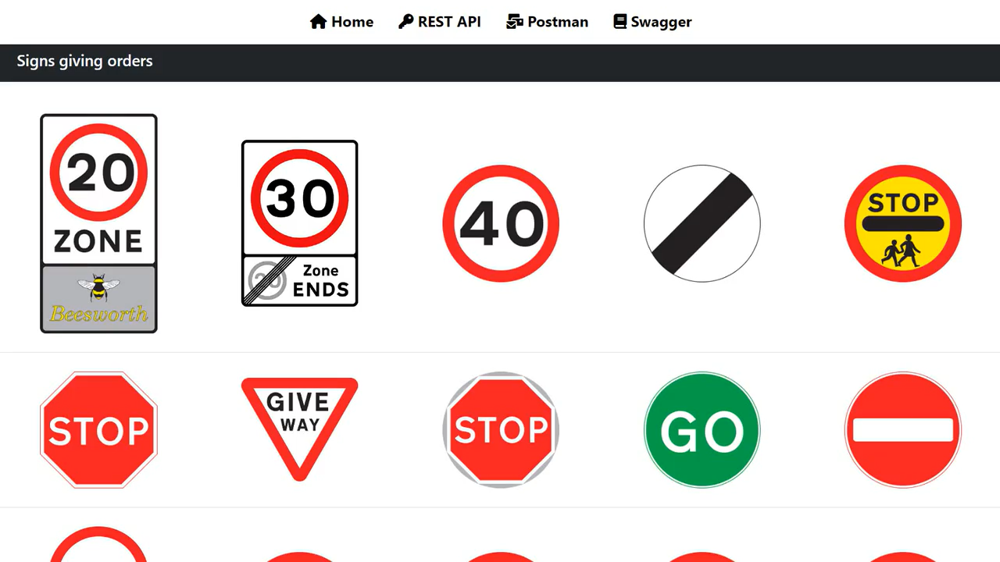
<br>
<i>1. The overview of UK Traffic Signs REST API</i></p>


<p align="center">
  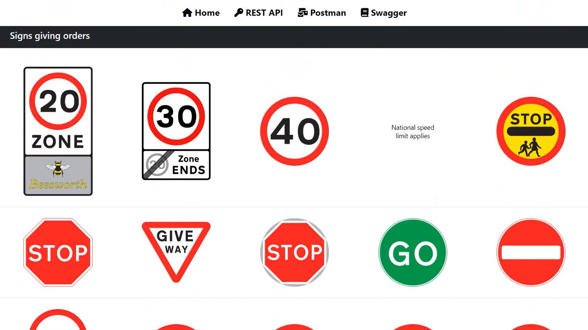
<br>
<i>2. The traffic sign description is displayed when the mouse hovers over it</i></p>


### Getting Started

These instructions will get you a copy of the project up and running on your local machine for development and testing purposes.

####  Prerequisites

- **Java** 17 or later
- **Java Spring Boot** 3.0.5 or later
- Additional dependencies: 
  - Lombok DEVELOPER TOOLS
  - Spring Web WEB
  - H2 Database SQL
  - Spring Boot DevTools DEVELOPER TOOLS
  - Spring Data JPA SQL
  - Validation
  - SpringDoc OpenAPI Starter WebMVC UI
  - Spring Boot Starter WebFlux
  - Reactor Spring Component

#### Installation

1. Download and install **Java 17 (JDK)** or above from <a href="https://www.oracle.com/java/technologies/downloads/" target="_blank">oracle.com</a>. Select the appropriate JDK software and click Download. The JDK software is installed on the local machine computer, for example, at **C:\Program Files\Java\jdk-17** under Windows System.

2. Set the **JAVA_HOME** environment variable to point to where the JDK software is located. On Windows, right-click **My Computer** and select **Properties**. On the **Advanced** tab, select **Environment Variables**, and then edit **JAVA_HOME** to point to the JDK software location, for example, **C:\Program Files\Java\jdk-17**.

3. Download the generated **Spring Boot project** from <a href="https://start.spring.io/" target="_blank">spring initializer</a> with the following settings:
- Project: **Maven**
- Language: Java
- Spring Boot: 3.0.5
- Project Metadata:
    - Group: com.project
    - Artifact: trafficsign
    - Name: trafficsign
    - Description: Demo project for Spring Boot
    - Project name: com.project.trafficsign
    - Packaging: Jar
    - Java: 17
- **Dependencies**:
    - Lombok
    - Spring Web
    - H2 Database
    - Spring Boot DevTools
    - Spring Data JPA
    - Validation

<p align="center">
  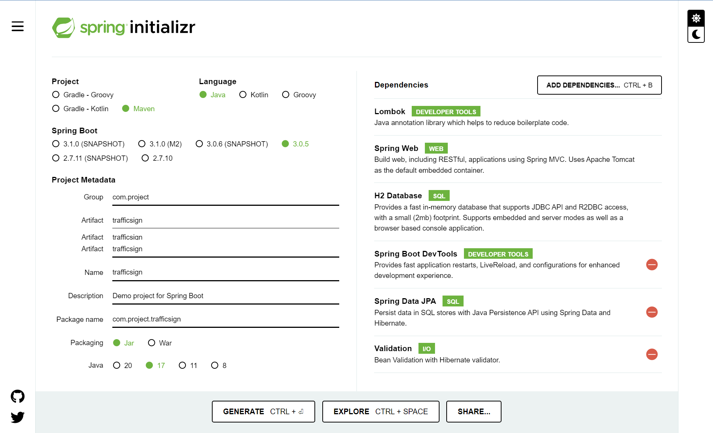
<br>
<i>3. Generate Java Spring Boot project in the spring initializer</i></p>


4. Add the following **dependencies** to the **pom.xml** file by copying them from <a href="https://mvnrepository.com/" target="_blank">MVN Repository</a>:
- <a href="https://mvnrepository.com/artifact/org.springdoc/springdoc-openapi-starter-webmvc-ui" target="_blank">SpringDoc OpenAPI Starter WebMVC UI</a>
- <a href="https://mvnrepository.com/artifact/org.springframework.boot/spring-boot-starter-webflux" target="_blank">Spring Boot Starter WebFlux</a>
- <a href="https://mvnrepository.com/artifact/org.projectreactor/reactor-spring" target="_blank">Reactor Spring Components</a>

```xml
    <dependency>
    	<groupId>org.springdoc</groupId>
    	<artifactId>springdoc-openapi-starter-webmvc-ui</artifactId>
    	<version>2.1.0</version>
    </dependency>
    <dependency>
    	<groupId>org.springframework.boot</groupId>
    	<artifactId>spring-boot-starter-webflux</artifactId>
    </dependency>
    <dependency>
    	<groupId>org.projectreactor</groupId>
    	<artifactId>reactor-spring</artifactId>
    	<version>1.0.1.RELEASE</version>
    </dependency>
```

5. **Start** a development server to see the project function properly
```
    .\mvnw clean spring-boot:run
```
6. Go to the development server at **http://localhost:8080**
<p align="center">
  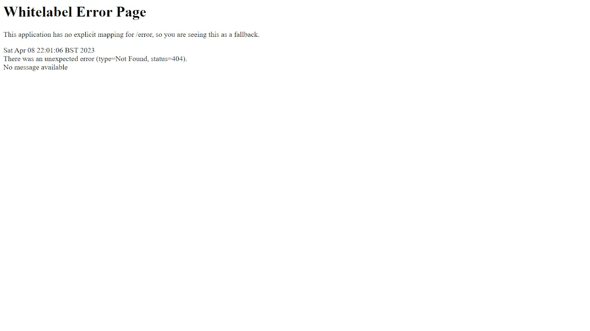
<br>
<i>4. The Whitelabel Error Page was found in the index page.</i></p>


7.  **Clone** the repository for your reference
```
git clone https://github.com/cwchan0212/self-jpa-trafficsign-api.git
```

8. **Navigate** to the project directory and copy the files according to the following file structures. 


### File Structure
```
.mvn/
├─ wrapper/
│  ├─ maven-wrapper.jar
│  ├─ maven-wrapper.properties
src/
├─ main/
│  ├─ java/
│  │  ├─ com/
│  │  │  ├─ project/
│  │  │  │  ├─ trafficsign/
│  │  │  │  │  ├─ config/
│  │  │  │  │  │  ├─ InitialDataLoader.java
│  │  │  │  │  │  ├─ SpringdocConfig.java
│  │  │  │  │  ├─ controller/
│  │  │  │  │  │  ├─ CategoryConsumeController.java
│  │  │  │  │  │  ├─ CategoryController.java
│  │  │  │  │  │  ├─ CategoryRestController.java
│  │  │  │  │  │  ├─ TrafficsignController.java
│  │  │  │  │  │  ├─ TrafficsignRestController.java
│  │  │  │  │  ├─ entity/
│  │  │  │  │  │  ├─ Category.java
│  │  │  │  │  │  ├─ Trafficsign.java
│  │  │  │  │  ├─ exception/
│  │  │  │  │  │  ├─ CategoryNotFoundException.java
│  │  │  │  │  │  ├─ TrafficsignNotFoundException.java
│  │  │  │  │  ├─ respository/
│  │  │  │  │  │  ├─ CategoryRepository.java
│  │  │  │  │  │  ├─ TrafficsignRepository.java
│  │  │  │  │  ├─ service/
│  │  │  │  │  │  ├─ CategoryService.java
│  │  │  │  │  │  ├─ CategoryServiceImp.java
│  │  │  │  │  │  ├─ TrafficsignService.java
│  │  │  │  │  │  ├─ TrafficsignServiceImp.java
│  │  │  │  │  ├─ TrafficsignApplication.java
│  ├─ resources/
│  │  ├─ db/
│  │  │  ├─ data.sql
│  │  │  ├─ schema.sql
│  │  ├─ static/
│  │  │  ├─ css/
│  │  │  │  ├─ script.js
│  │  │  ├─ js/
│  │  │  │  ├─ style.css
│  │  ├─ templates/
│  │  │  ├─ fragments/
│  │  │  │  ├─ base.html
│  │  │  ├─ category.html
│  │  │  ├─ index.html
│  │  │  ├─ trafficsign.html
│  │  ├─ application.properties
├─ test/
│  ├─ java/
│  │  ├─ com/
│  │  │  ├─ project/
│  │  │  │  ├─ trafficsign/
│  │  │  │  │  ├─ TrafficsignApplicationTests.java
target/
├─ trafficsign-0.0.1-SNAPSHOT.jar
├─ trafficsign-0.0.1-SNAPSHOT.jar.original
mvnw
mvnw.cmd
pom.xml
README.md


```

### Model

#### Category
The **Category** model has several fields: 
* id as primary key (generated automatically by the database)
* name
* description

The **id** field is set as the **primary key**, which means that it is unique for each tile and will be used as the identifier for the category. 

#### Traffic Sign
The **Traffic Sign** model also has several fields: 
* id as primary key (generated automatically by the database)
* text
* filename
* image
* category_id as the foreign key of **Category**
 
The **id** field is set as the **primary key**, which means that it is unique for each task. It also has a **foreign key** called **Category**, which is a reference to the id (category) primary key field in the **Traffic Sign** model. This establishes a one-to-many relationship between the Category and Traffic Sign models, as one Category can have multiple tasks.

### Usage

1. Start the development server.

2. Open a web browser and navigate to `http://localhost:8000/` to navigate the UK Traffic sign REST API portal to simply perform CRUD of Category and Traffic Sign with the following endpoints.

3. Go to the REST API tab to manage the Category and Traffic Sign.

<p align="center">
  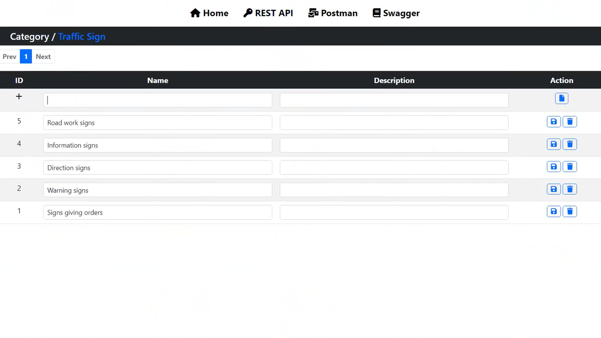
<br>
<i>5. Category under REST API tab</i></p>

<p align="center">
  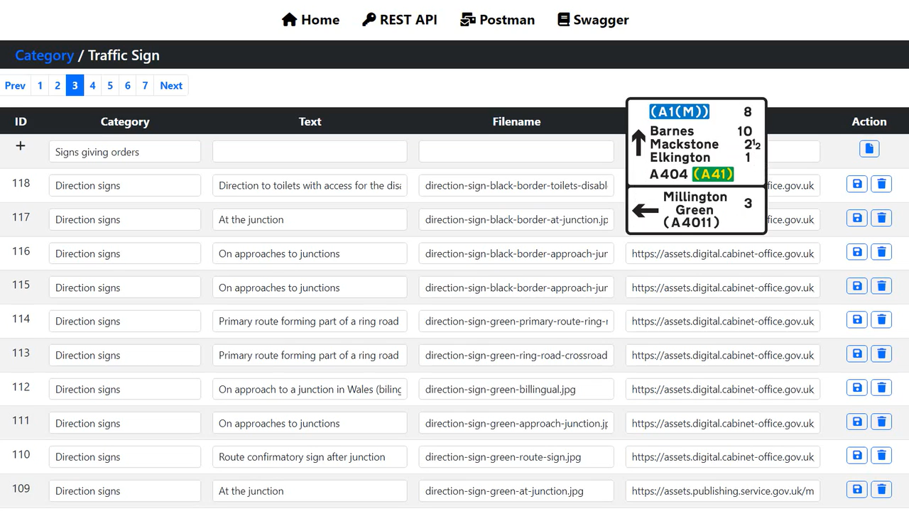
<br>
<i>6. Traffic Sign under REST API tab</i></p>


4. Alternatively, the user can navigate to <a href="https://www.postman.com/" target="_blank">Postman API platform</a> to perform CRUD of Category and Traffic Sign with the following endpoints of the UK Traffic sign REST API portal.

#### Category
- **READ** all categories: GET http://localhost:8080/api/category
- **CREATE** 1 category: POST http://localhost:8080/api/category
- **READ** 1 category: GET http://localhost:8080/api/category/{categoryId}
- **UPDATE** 1 category: PUT http://localhost:8080/api/category/{categoryId}
- **DELETE** 1  category: DELETE http://localhost:8080/api/category/{categoryId}


<p align="center">
  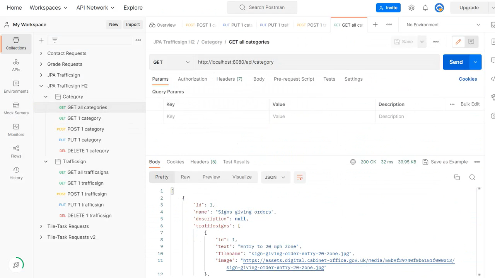
<br>
<i>7. Category: READ all categories (GET method) in the POSTMAN API platform</i></p>
    
<p align="center">
  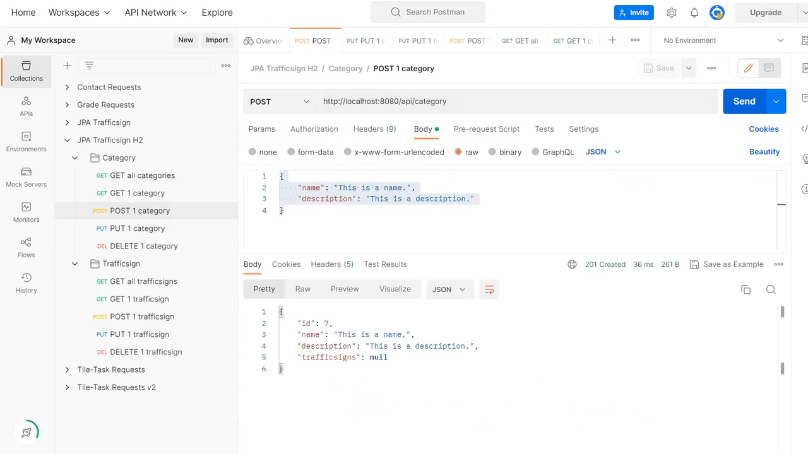
<br>
<i>8. Category: CREATE category (POST method) in the POSTMAN API platform</i></p>


<p align="center">
  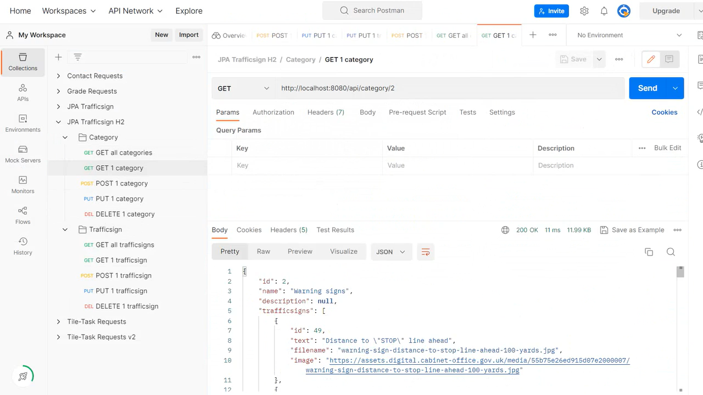
<br>
<i>9. Category: READ category (GET method) in the POSTMAN API platform</i></p>

<p align="center">
  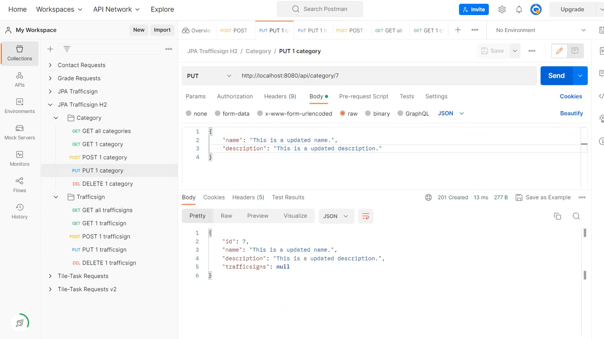
<br>
<i>10. Category: UPDATE category (PUT method) in the POSTMAN API platform</i></p>

<p align="center">
  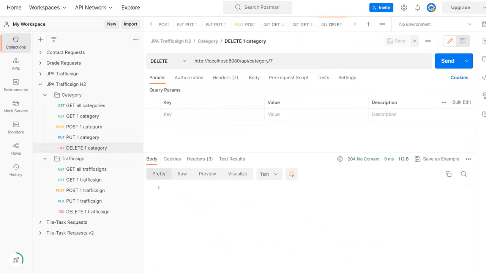
<br>
<i>11. Category: DELETE category (DELETE method) in the POSTMAN API platform</i></p>

#### Traffic Sign
- **READ all** traffic signs: GET http://localhost:8080/api/trafficsign
- **CREATE** 1 traffic sign: POST http://localhost:8080/api/trafficsign
- **READ** 1 traffic sign: GET http://localhost:8080/api/trafficsign/{trafficsignId}
- **UPDATE** 1 traffic sign: PUT http://localhost:8080/api/trafficsign/{trafficsignId}
- **DELETE** 1 traffic sign: DELETE http://localhost:8080/api/trafficsign/{trafficsignId}

<p align="center">
  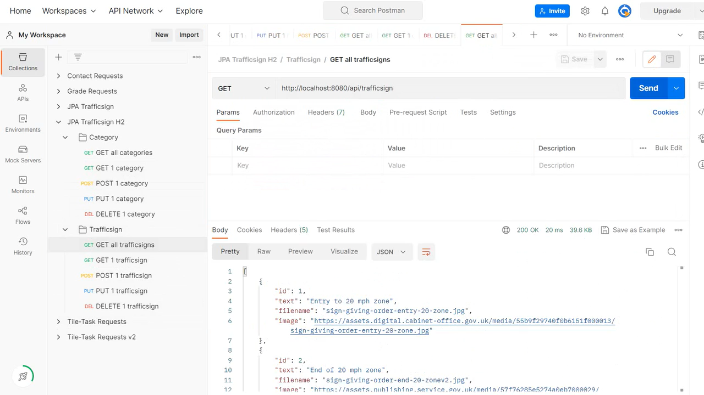
<br>
<i>12. Traffic Sign: READ all traffic signs (GET method) in the POSTMAN API platform</i></p>
    
<p align="center">
  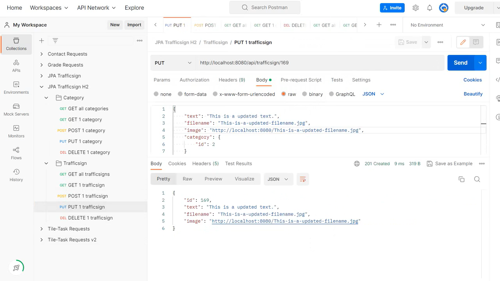
<br>
<i>13. Traffic Sign: CREATE traffic sign (POST method) in the POSTMAN API platform</i></p>


<p align="center">
  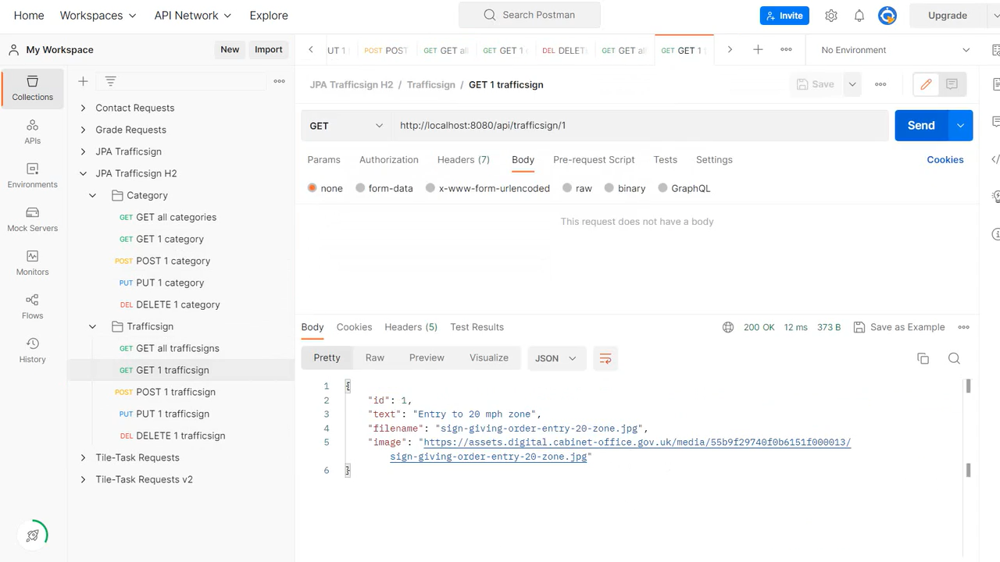
<br>
<i>14. Traffic Sign: READ traffic sign (GET method) in the POSTMAN API platform</i></p>

<p align="center">
  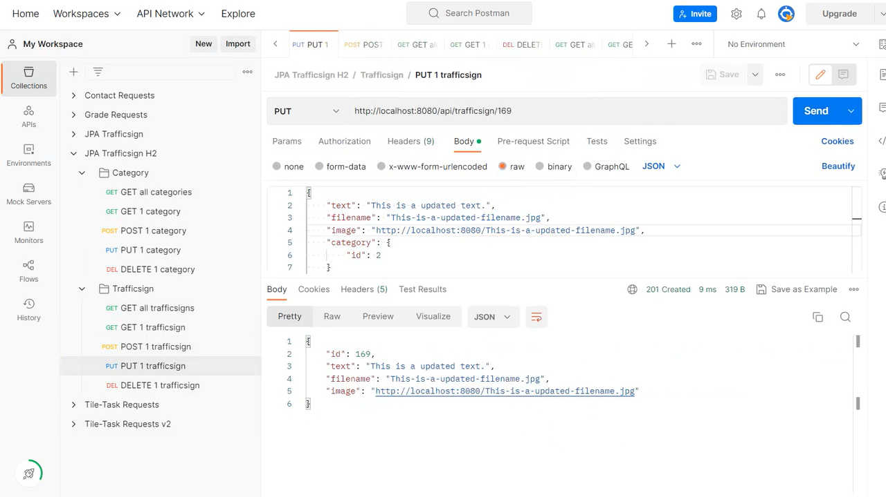
<br>
<i>15. Traffic Sign: UPDATE traffic sign (PUT method) in the POSTMAN API platform</i></p>

<p align="center">
  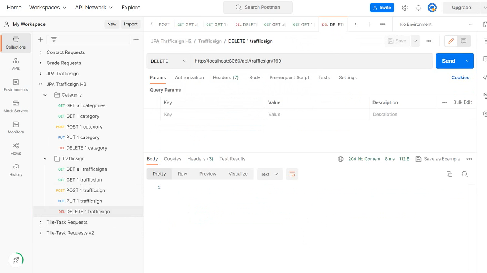
<br>
<i>16. Traffic Sign: DELETE traffic sign (DELETE method) in the POSTMAN API platform</i></p>

  
### API Documentation

The user can navigate to check the UK Traffic Signs REST API documentation at http://localhost:8000/swagger-ui/index.html .

<p align="center">
  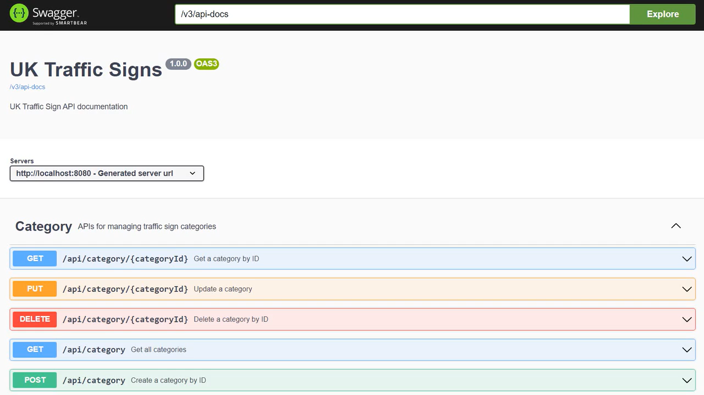
<br>
<i>17. The UK Traffic Signs REST API documentation under Swagger</i></p>

### Key Takeaways

#### 1. Configuring **Template Paths** in Spring Boot

```
spring.thymeleaf.prefix=file:src/main/resources/templates/
spring.thymeleaf.prefix=classpath:/templates/
```

Here is a short note on the differences between **file** and **classpath** of spring.thymeleaf.prefix in the file application.properties. 

**spring.thymeleaf.prefix=file:src/main/resources/templates/**: This line specifies the location of the templates directory on the file system, relative to the project directory. When using this line, the templates directory must exist at the specified location and contain the necessary files. This is typically used during development when **running the application from an IDE or local machine**.

**spring.thymeleaf.prefix=classpath:/templates/**: This line specifies the location of the templates directory on the classpath. This means that the templates directory is bundled with the application and can be accessed regardless of the file system location. This is typically used when **deploying the application as a JAR or WAR file to a server**.

#### 2. Understanding the **Roles** and **Responsibilities** of JPA Components

In the context of JPA (Java Persistence API), the following are some common functions of the different components in a typical JPA-based application:

**Controller**: Receives and handles **incoming HTTP requests**, typically from a web application or API client. The controller may validate user input, interact with the JPA repository, and prepare a response to send back to the client.

**Repository**: Provides a set of methods for **accessing and managing persistent data** using JPA. The repository typically interacts with the database through a JPA EntityManager or Session, and performs operations such as creating, reading, updating, and deleting entities.

**Service**: Contains the **business logic of the application**, typically acting as a bridge between the controller and the repository. The service may perform more complex data processing or validation, orchestrate multiple repository calls, and handle transactions and exceptions.

**Web**: Provides **utility classes and annotations** for building web applications using JPA, such as defining REST endpoints, handling HTTP requests and responses, and managing user sessions and authentication.

**Entity**: Represents a **persistent object** in the application's domain **model**. Entities typically map to database tables, and define the fields, relationships, and constraints of the data model. Entities may also include JPA annotations to specify how they should be persisted and retrieved.

**Exception**: Represents a **specific error or problem** that can occur during the execution of a JPA-based application. Exceptions may be thrown by the repository, service, or controller layers, and can be handled by the web layer to return appropriate HTTP error codes and messages to the client.

### Credits
- <a href="https://www.gov.uk/guidance/the-highway-code/traffic-signs" target="_blank">The Highway Code of GOV.UK</a>
- <a href="https://www.highwaycodeuk.co.uk/signs-and-signals.html" target="_blank">Traffic Signs and Signals</a>
